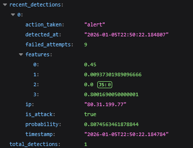
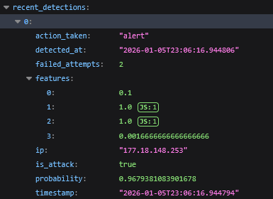
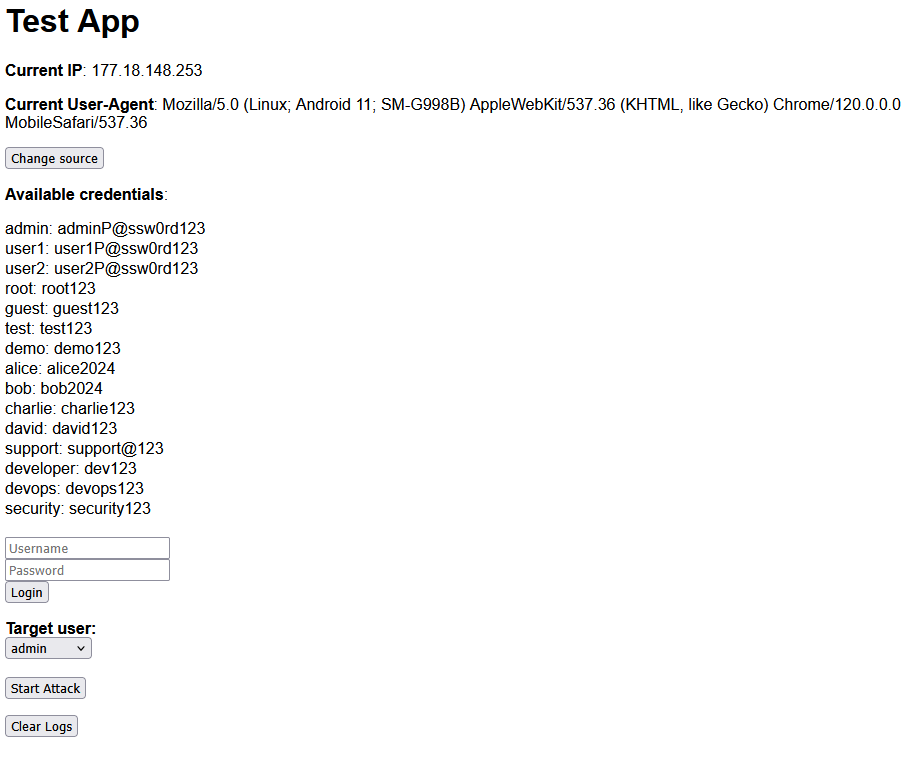

# Brute Force Detector

This project implements binary classification using logistic regression to act as a (pseudo) AI that detects brute force attacks based on login attempt logs + hardcoded values (that in a real world scenario would be learned from data).

Basically, it puts together everything learned in the first week of the Deep Learning Specialization by Andrew Ng on Coursera, especially the binary classification class.

## Features, weights and whys
- Volume: number of failed attempts from an IP / weight = 4.0 - brute force attacks usually involve many attempts
- Speed: rate (attempts per second) / weight = 3.5 - important since brute force attacks usually try to be fast
- Time Concentration: how many attempts occur in a short time window / weight = 3.5 - differentiates from speed because it looks at concentration of attempts in a time window (bursts / how clustered in time)
- Persistence: how long the attack occurred / weight = 4.5 - some brute force attacks are persistent over time, not just burst or fast continuous attempts

## Examples
### "Slow" attack (60 seconds between attempts - continuous):

- Volume: 0.45... (9 failed attempts)
- Speed: 0.009...
- Time Concentration: 0.0 (all attempts spread out)
- Persistence: 0.80... (9 failed attempts continuous over 9 minutes, usually a real person would not try that long continuously)

### Fast attack (0.15 seconds between attempts - continuous - usual brute force):

- Volume: 0.1 (2 failed attempts first time it was detected)
- Speed: 1.0 (very fast attempts, humans can't type that fast, that's why it was detected quickly)
- Time Concentration: 1.0 (all attempts in a short time window / burst)
- Persistence: 0.001... (it was detected quickly, but if it continued it would increase)

## Application

### Web Interface:
- `localhost:5001/` - main page - Shows a simulated IP and user-agent (that I didn't use for this project). You can change both pushing `change source` button. You can manually log in (success or fail) or start a brute force attack simulation against a chosen target. Also, you can clear logs.

- `localhost:5001/logs` - show all logs 

## Endpoints
- `localhost:5001/api/logs` - get all logs in JSON
- `localhost:5001/api/stats` - get stats about total IPs, suspicious, hours of the day with most detections, top offending IPs, etc.
- `localhost:5001/api/detections` - get all detections in JSON
- `localhost:5001/api/start_attack` - brute force simulation (that you can trigger from the main page)
- `localhost:5001/api/change_source` - change source IP and user-agent (that you can trigger from the main page)
- `localhost:5001/api/set_source` - set source IP and user-agent to the session (after changing from the main page)
- `localhost:5001/api/clear_logs` - clear all logs (that you can trigger from the main page)
- `localhost:5001/api/logs/probabilities` - get probabilities of brute force detection for all IPs in logs
